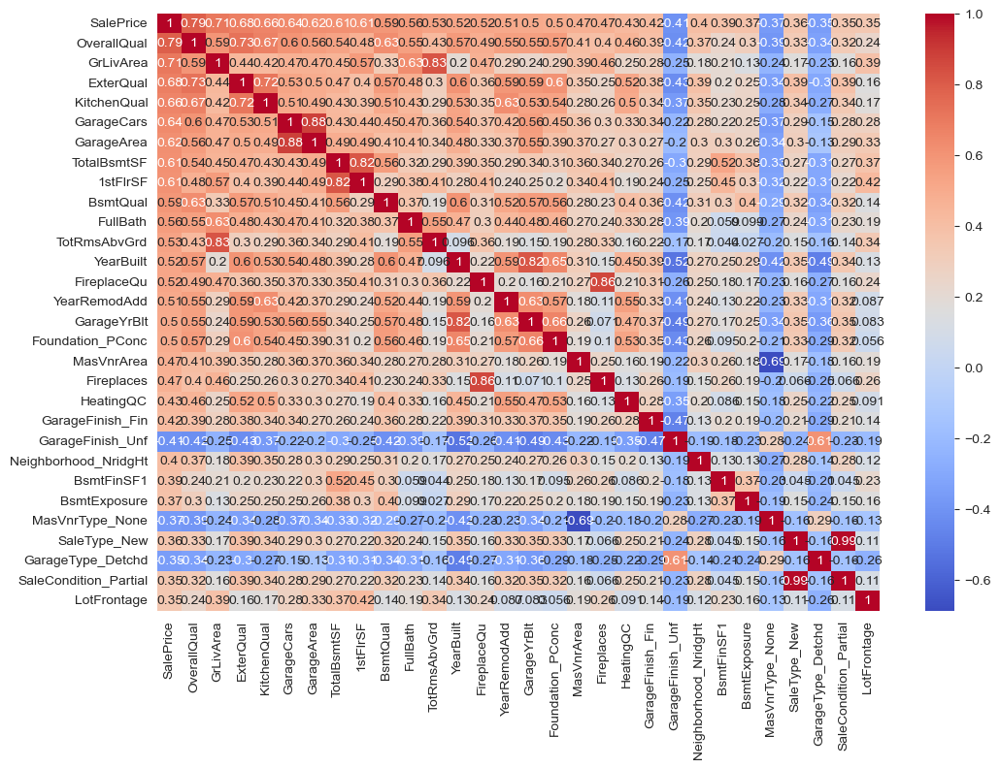

# House Prices: линейные модели и регуляризация

Проект по табличной регрессии для прогнозирования стоимости жилой недвижимости. Основной акцент сделан на интерпретируемой предобработке, отборе признаков и сравнении Linear, Ridge и Lasso Regression.

## Результаты

| Модель | RMSE на hold-out | R² на hold-out |
|---|---:|---:|
| Linear Regression | $28,116.15 | 0.89 |
| **Ridge Regression** | **$28,114.22** | **0.89** |
| Lasso Regression | $29,373.73 | 0.88 |

Ridge Regression показала лучший результат и была выбрана как финальная модель.



## Подход

- анализ структуры train/test и пропусков;
- кодирование категориальных признаков и подготовка числовых переменных;
- отбор наиболее информативных признаков с контролем избыточной корреляции;
- логарифмирование целевой переменной `SalePrice`;
- сравнение Linear, Ridge и Lasso Regression;
- подбор силы регуляризации с помощью кросс-валидации;
- формирование `submission.csv` в формате соревнования.

## Инструменты

Python, pandas, NumPy, scikit-learn, matplotlib, seaborn, Jupyter.

## Структура репозитория

```text
Линейная регрессия.ipynb  анализ, моделирование и сохранённые результаты
train.csv                  обучающие данные
test.csv                   тестовые данные
data_description.txt       описание признаков
assets/                    графики, вынесенные из ноутбука
requirements.txt           зависимости проекта
```
